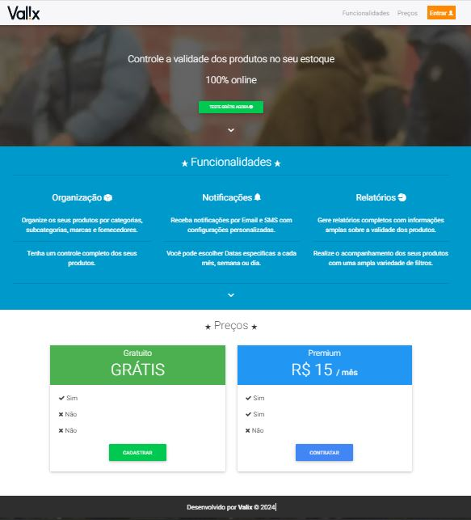
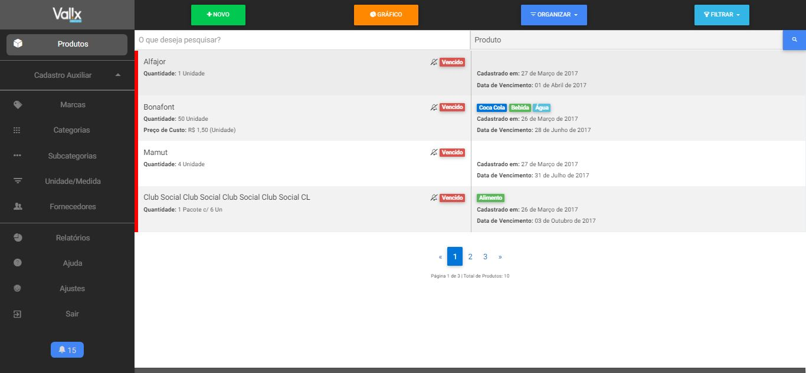

<h1>Sistema de Alerta de Vencimento de Produtos</h1>

O <b>Valix</b> é um sistema projetado para auxiliar aqueles que gerenciam estoques de produtos e enfrentam dificuldades para controlar suas datas de validade. Com o Valix, é possível cadastrar os produtos com detalhes como quantidade, marca, categoria, fornecedor e até mesmo descrição e localização no estoque, simplificando a busca pelo produto quando o sistema emitir um alerta de proximidade do vencimento. Esses alertas são enviados por e-mail e SMS, acompanhados de um relatório que destaca os produtos próximos da validade.

O Valix não é um produto comercial, mas sim uma ideia de projeto concebida com o propósito de aprendizado e aplicação prática de diversas tecnologias de desenvolvimento de sistemas. 

O Projeto utiliza PHP como linguagem backend e como banco de dados o MySQL, já no frontend utiliza HTML5, JavaScript com a biblioteca jQuery e CSS com a biblioteca Bootstrap. Todo o projeto segue o padrão Orientado a Objetos, com a implementação do pattern Data Access Object (DAO) para separação das regras de negócio e de acesso ao banco de dados. Além disso, utiliza-se o módulo PDO do PHP para conexão e transação com o banco de dados.

<h1>Utilizando o Sistema</h1>

Após fazer o download do repositório, dentro da pasta "docs" você encontrará o dump do banco de dados, que inclui um usuário e alguns produtos já cadastrados. Basta importá-lo para o banco de dados MySQL. Os dados de acesso ao sistema para o usuário cadastrado estão disponíveis no arquivo 'acesso_login.txt', também localizado na pasta "docs".

<h1>Captura de Tela</h1>
<strong>Home</strong>
  

  
<strong>Dashboard</strong>
 

